# Prompts

> Note: Some minor prompts were omitted from this record, including prompts used to create commits and make final adjustments. Several `/review` commands were also used to identify failures and issues during development.

## Prompt 1: Reformat Assignment
read assignment.md and reformat it into a hierarchical Markdown document 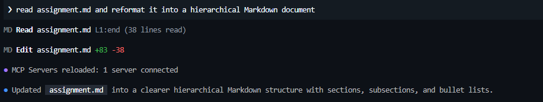

## Prompt 2: Analyze Assignment
Analyze the complete assignment assignment.md

Propose a realistic solution that can be completed in the given time frame.

Do not implement any code yet.

Define:

- the recommended minimum scope
- the endpoints
- the exact request and response formats
- errors and HTTP status codes
- validation rules
- the testing strategy
- acceptance criteria
- design decisions and assumptions

Then create  spec.md  as the single source of truth and make it precise enough for other agents to implement the project 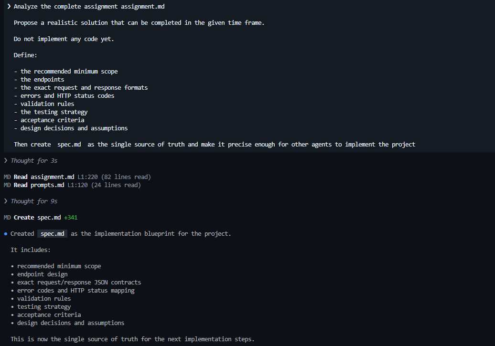

### Prompt 2.1

The API contracts are returning redundant information. It is not necessary to include the values used to invoke the operation. Furthermore, the "ok" variable to indicate status is redundant, since the HTTP status code already serves that purpose 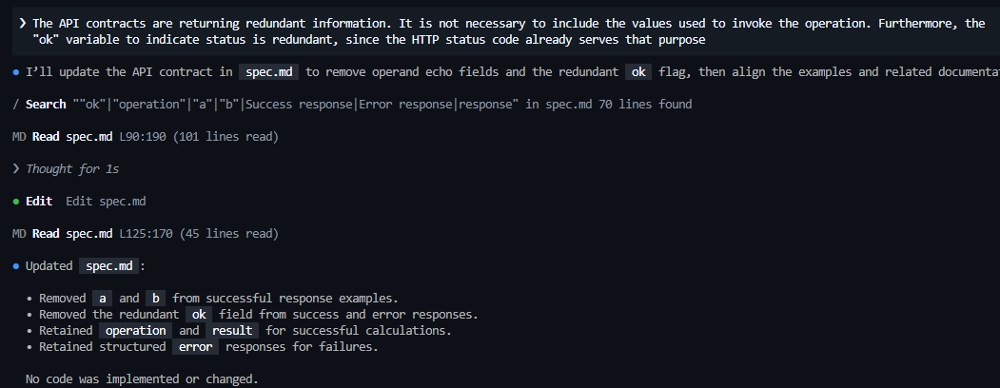

### Prompt 2.2
In the validation rules, it is stated that variable b is not required for the percentage operation. However, later the percentage calculation is defined based on b, which creates an inconsistency in the specification 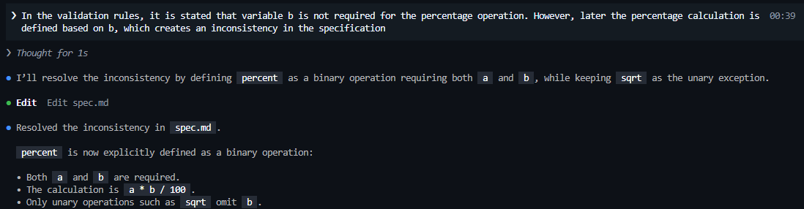

### Prompt 2.3
The rounding rule in section 7.3 Number Handling is defined ambiguously. It states that rounding should be limited to a "reasonable precision" but this leaves room for different interpretations across implementations.
The recommendation is to compute and return results using standard float64 JSON encoding. Precision and presentation control should be handled by the frontend 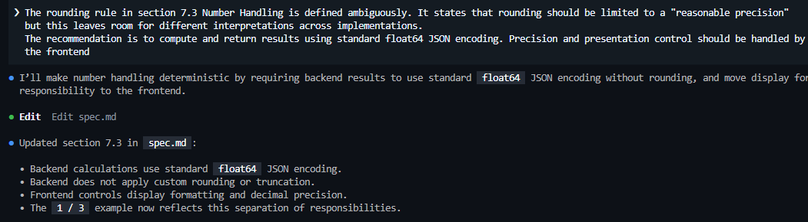

### Prompt 2.4
Although the specification mentions that parameter b is not required for unary operations, it does not define how to ensure that the number of parameters provided is correct. Relying on conditional checks for each unary operation makes the code harder to maintain. Consider designing classes or interfaces that explicitly define the expected number of parameters for each operation. This approach improves maintainability and ensures that parameter validation is consistent and reliable across all operations 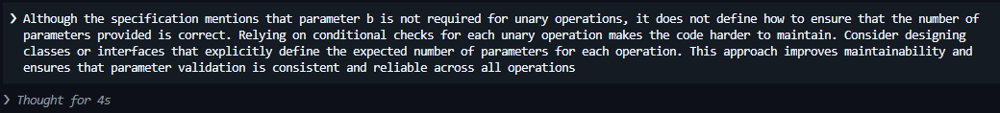

### Prompt 2.5
The response payload currently includes the operation field along with the result. This is redundant, since the client already knows which operation was requested 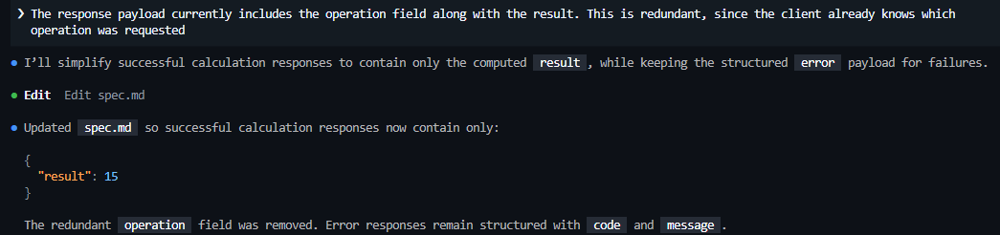

### Prompt 2.6
The response payload currently includes the operation field along with the result. This is redundant, since the client already knows which operation was requested

### Prompt 2.7
In the Backend validation section, the specification mentions "an operand count that does not match the selected operation" This phrasing can be ambiguous, since a binary operation should explicitly require both operands a and b, while a unary operation should only require a. To avoid confusion and improve maintainability, the expression should be redefined more precisely. Alternatively, consider using an array of parameters 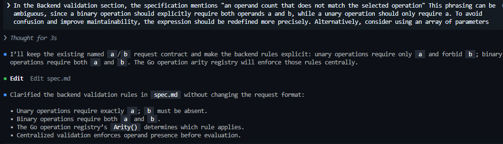

### Prompt 2.8
In some parts of the specification, certain operations are described as optional, while in others they are treated as mandatory. This inconsistency can lead to confusion and misalignment between the frontend and backend. For the sake of clarity and consistency, all operations should be defined as mandatory within the specification 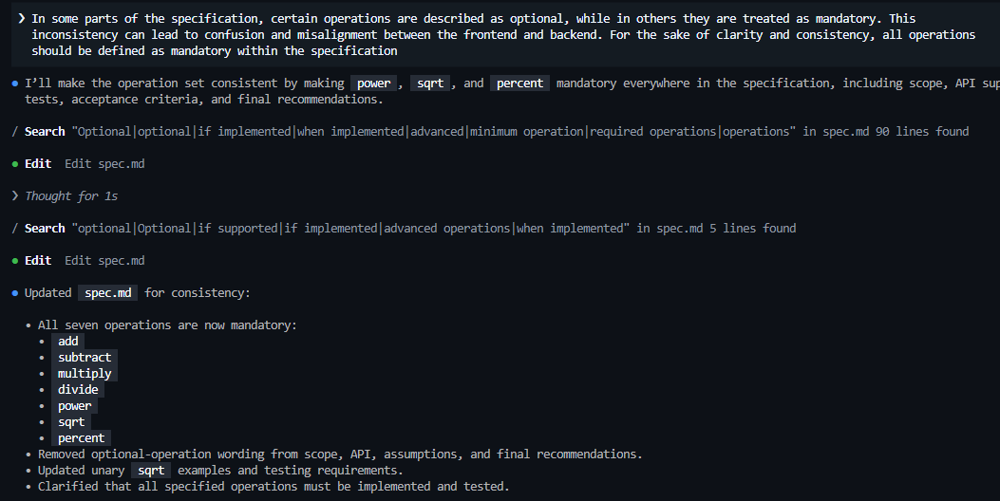

### Prompt 2.9
The specification does not define how to handle null fields or undefined fields in requests. For practicality and consistency, undefined fields should be ignored, while existing fields must be validated to ensure they are non-null numeric values 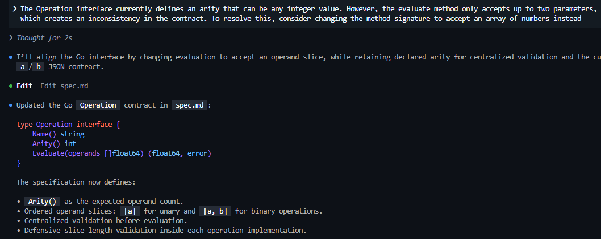

### Prompt 2.10
The Operation interface currently defines an arity that can be any integer value. However, the evaluate method only accepts up to two parameters, which creates an inconsistency in the contract. To resolve this, consider changing the method signature to accept an array of numbers instead 

### Prompt 2.11
The evaluate method currently receives a list of numbers, yet the API contract still refers to operands a and b. This creates an inconsistency between the interface and the contract. To resolve this, the contract should be updated to define operands as a list of numbers instead of fixed fields 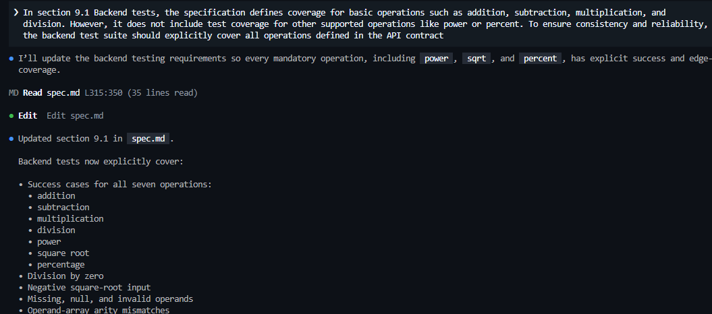

### Prompt 2.12
In section 9.1 Backend tests, the specification defines coverage for basic operations such as addition, subtraction, multiplication, and division. However, it does not include test coverage for other supported operations like power or percent. To ensure consistency and reliability, the backend test suite should explicitly cover all operations defined in the API contract 

### Prompt 2.13
Define a lightweight testing contract to decouple behavioral tests from concrete implementations.

Use:

type Calculator interface {
    Calculate(operation string, operands []float64) (float64, error)
}

func NewCalculator() Calculator

Tests must depend only on this contract and not on concrete operation structs, internal fields, or registry implementation details 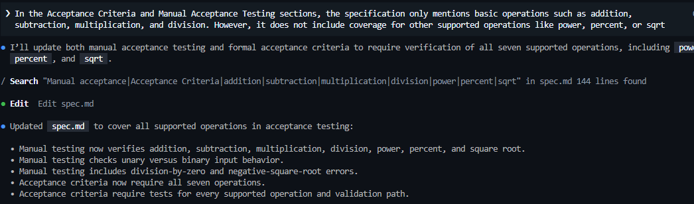

### Prompt 2.14
In the Acceptance Criteria and Manual Acceptance Testing sections, the specification only mentions basic operations such as addition, subtraction, multiplication, and division. However, it does not include coverage for other supported operations like power, percent, or sqrt 

### Prompt 2.15
The specification states that missing operands and explicit null operands are both invalid, but their validation behavior should be defined precisely.

Update the contract so that:

An omitted required field returns MISSING_FIELD.
An explicitly provided null value returns INVALID_TYPE.
This distinction applies consistently to required request fields and operand elements.

The Go implementation must use a presence-aware representation that can reliably distinguish omitted fields from explicit null values when decoding JSON (for example, a custom JSON type or equivalent mechanism). Do not assume pointer fields alone are sufficient 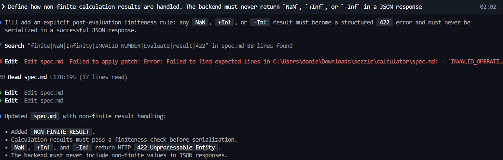

### Prompt 2.16
Define how non-finite calculation results are handled. The backend must never return `NaN`, `+Inf`, or `-Inf` in a JSON response 

### Prompt 2.17
Define `power(a, b)` using Go's `math.Pow` semantics. update the operation table and relevant validation/testing sections 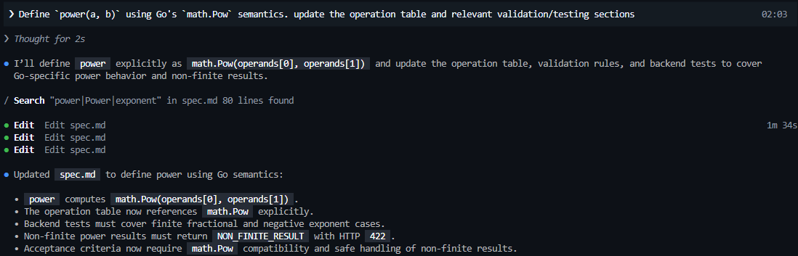

### Prompt 2.18
/review assignment.md spec.md Compare the assignment statement (assignment.md) with the solution plan (spec.md). 
Identify inconsistencies, missing coverage, or ambiguities between the two documents 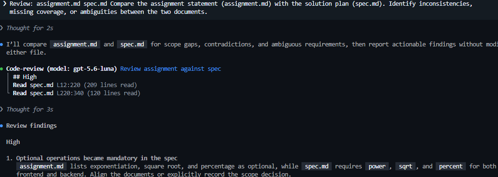

## Prompt 3: Implement Assignment
Implement the project according to spec.md.

Use a separate Git worktree for each agent and do not let agents modify the same worktree concurrently.

Run these workstreams:

1. Backend tests
- Read only spec.md.
- Create Go tests covering all operations and edge cases.
- Do not read or modify backend implementation or spec.md.

2. Backend implementation
- Implement the Go REST API according to spec.md.
- Do not read or modify the tests created by the test agent.
- Run formatting, static checks, and backend tests available in its worktree.

3. Frontend
- Implement the React + TypeScript UI according to spec.md.
- Consume the backend API without duplicating business logic.
- Include the required frontend tests.
- Run frontend tests and the production build.

Afterward, create an integration worktree, combine all changes, resolve only integration issues, and run the complete backend and frontend validation suite.

Do not change spec.md or add features outside its scope. Report worktrees, changed files, commands, and validation results 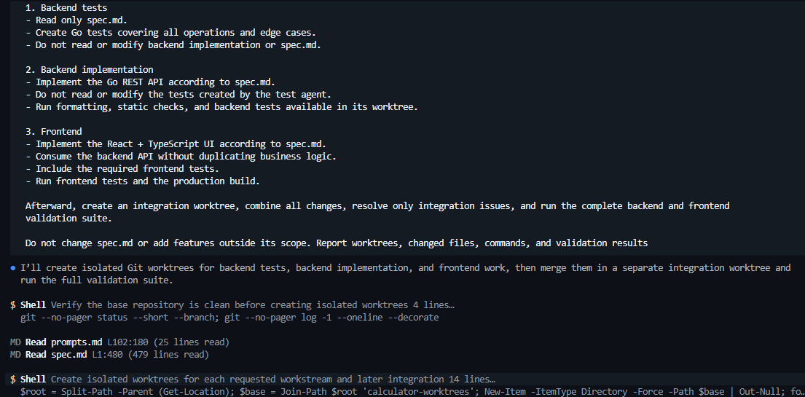

### Prompt 3.1
The frontend is failing with: "Failed to execute 'json' on 'Response': Unexpected end of JSON input".
Please check:
- Whether the backend endpoint returns a valid JSON body for all cases.
- If error responses are missing or truncated, ensure they follow the contract (structured error object).
- Confirm that the frontend fetch call uses `response.json()` only when the response has a body.
Suggest fixes in both backend and frontend to guarantee predictable JSON responses 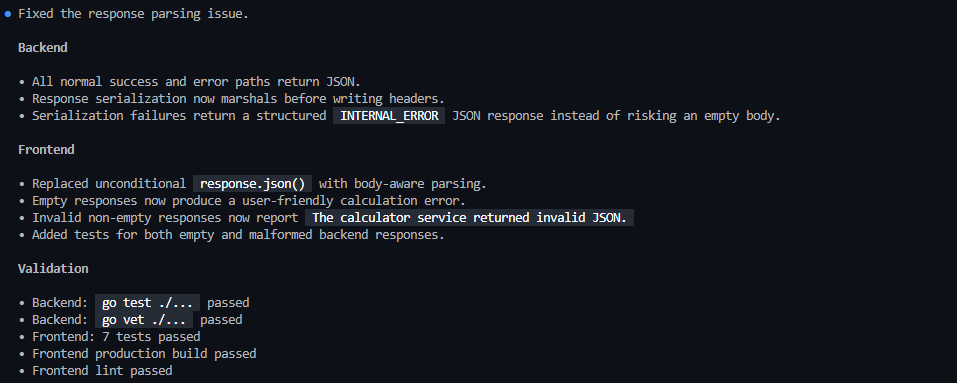

### Prompt 3.2
The frontend shows: POST http://127.0.0.1:5173/api/calculate 404 (Not Found) 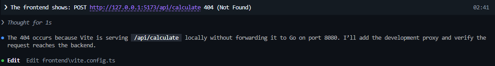

### Prompt 3.3
The calculator currently displays very large exponentiation results (e.g., 2^1000) in raw scientific notation (1.0715086071862673e+301). 
This output overflows the green result container and becomes unreadable. 

Please check:
- Format large numbers for readability (limit decimal places or use scientific notation with fixed precision).
- Ensure the result container (green div) adapts to long outputs, either by wrapping text or resizing dynamically.
- Confirm backend continues returning raw float64 values, while frontend handles presentation formatting 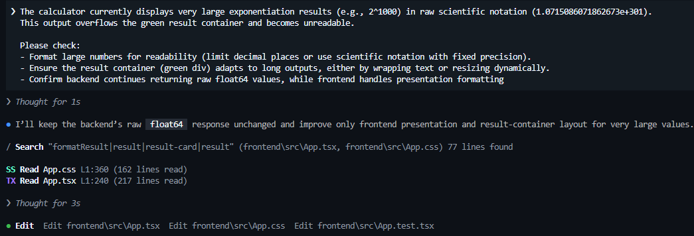

### Prompt 3.4
Conceptually, divideOperation should be implemented using the existing binaryOperation abstraction, since it is a binary operator with arity = 2. 
Similarly, sqrtOperation should be modeled using a reusable unaryOperation abstraction (arity = 1) instead of implementing the interface directly. 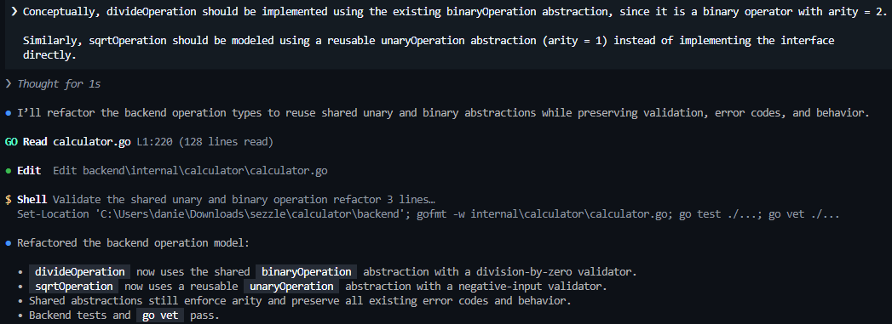

### Prompt 3.5
Currently, multiple error messages are hardcoded across operations. Define constants for all error messages, similar to how error codes are already centralized 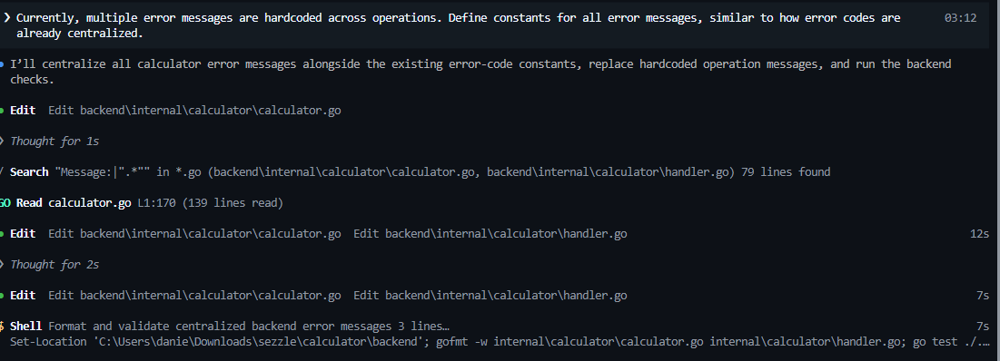

### Prompt 3.6
Compare the current implementation against the requirements defined in spec.md. Provide clear, actionable corrections or refactor suggestions to bring calculator.go fully in line with spec.md 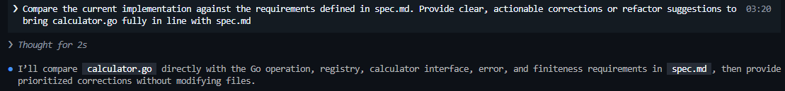

### Prompt 3.7
Add lightweight structured request logging to the Go backend according to the current implementation 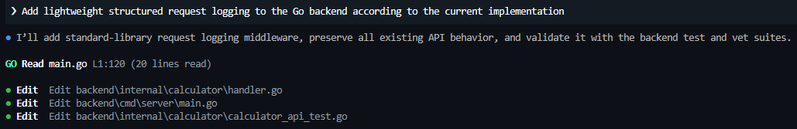

### Prompt 3.8
/review 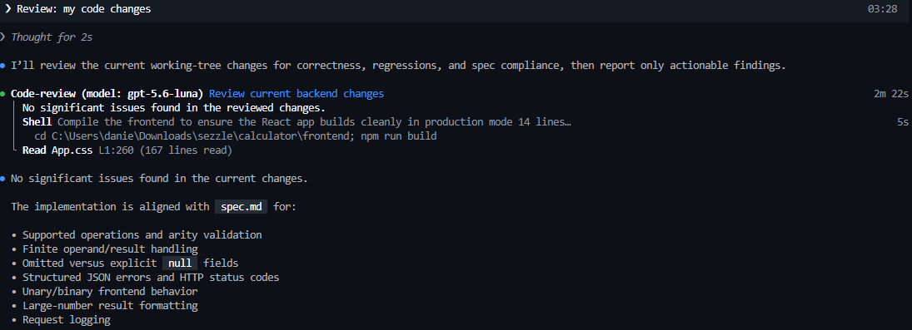

## Prompt 4
Create the necessary Dockerfile to run the project in a reproducible environment. Update README.md with clear instructions covering exactly the following sections:  
- Setup instructions
- How to run the frontend and backend
- Examples of API calls (if using REST)
- Design decisions or assumptions 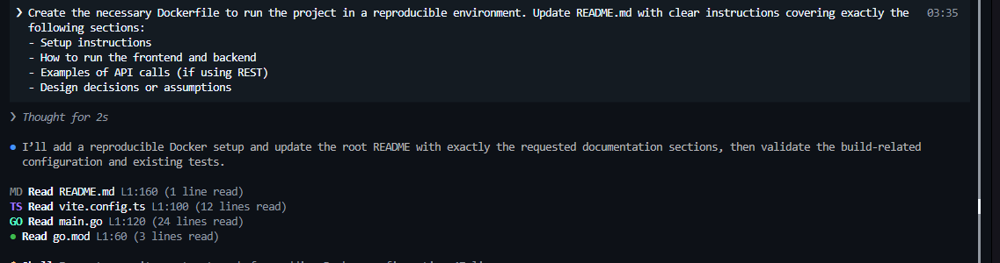

## Prompt 5
include the test coverage 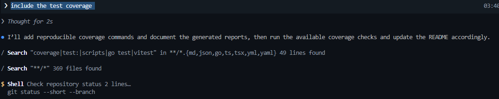

### Prompt 5.1
Increase coverage for these: 
- HTTP method and route rejection
- malformed JSON and duplicate/unknown fields
- missing,  null , and invalid operand values 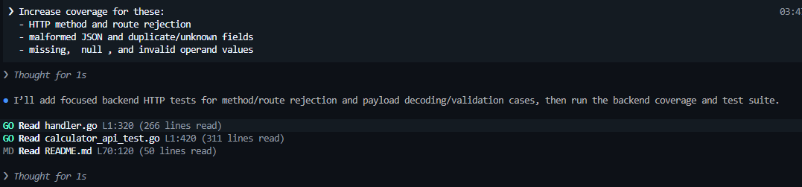

